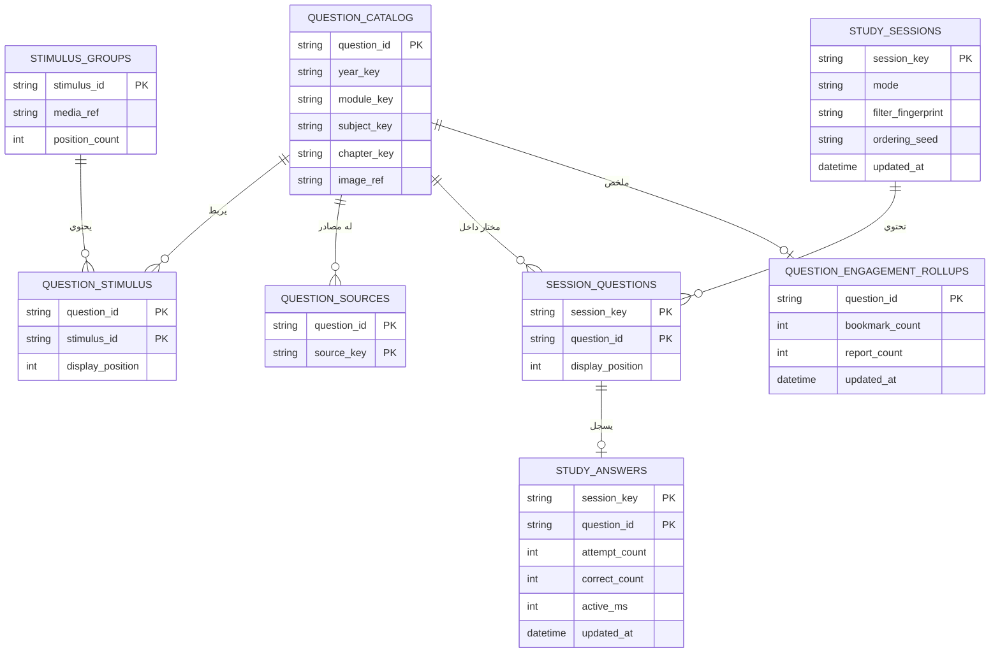

# مخطط منطقي منقّى لقاعدة البيانات

ده مخطط تعليمي للعلاقات، وليس نسخة من قاعدة بيانات الإنتاج. الهدف منه توضيح فصل محتوى الأسئلة عن حالة الجلسات وعن العروض التجميعية، بحيث بنك كبير من الأسئلة لا يحتاج إلى joins ضخمة أو تحميل تاريخ المستخدم كاملًا في كل شاشة.

## تقسيمة المجالات

### ١. المحتوى الثابت

`question_catalog` يحتفظ بالبيانات الصغيرة اللازمة للفلترة والتعرف على السؤال. `stimulus_groups` يحتفظ ببيانات الحالة أو الوسائط المشتركة. جداول الربط تمنع تكرار صورة أو حالة كبيرة داخل كل سجل سؤال.

### ٢. حالة المذاكرة

`study_sessions` يحدد سياق جلسة المذاكرة المحفوظة. `session_questions` يحتفظ بمجموعة الأسئلة وترتيبها داخل هذا السياق. `study_answers` يستخدم المفتاح المركب `(session_key, question_id)`، وبالتالي إجابة السؤال نفسه في جلستين مختلفتين لا تكتب فوق بعضها.

### ٣. النماذج التجميعية للقراءة

`question_engagement_rollups` هو ملخص صغير لعدادات البوك مارك والبلاغات على مستوى السؤال. ويمكن فصل ملخص الليدر بورد حسب الفترة الزمنية. النماذج دي تمنع صفحات الليدر بورد أو السؤال من عمل join مع تاريخ خاص كامل.

## إرشادات تقسيم توضيحية

- **مجال المحتوى:** يتم تنظيم بيانات المنهج وجداول الربط حسب نطاق المنهج والإصدار، مع عمل indexes على أعمدة الفلترة والـIDs الثابتة، ومنع تكرار ملفات الصور الكبيرة داخل صف السؤال.
- **مجال حالة المذاكرة:** القراءات يتم تجميعها حول `session_key` غير المكشوف، مع مفاتيح مركبة تبدأ به. ده يحافظ على حجم نافذة الجلسة ويمنع تصادم نفس question ID عندما يظهر في جلستين.
- **المجال التجميعي:** يتم تقسيم أو تلخيص البيانات حسب الفترة والنطاق، حتى تقرأ صفحات الليدر بورد والتفاعل projection صغيرًا بدل تاريخ الأحداث الكامل.
- **حد الوسائط:** يتم حفظ مرجع الصورة وأبعادها بعد التحقق داخل بيانات الوصف، بينما يظل الملف نفسه ودورة الكاش منفصلين.

دي إرشادات تنظيم وأداء وليست تعليمات لنسخ layout الإنتاج. السيرفر الفعلي يحتاج أيضًا سياسات للصلاحيات والاحتفاظ والنسخ الاحتياطي والمعاملات.

## قواعد الربط

- ربط المحتوى بالـstimulus يتم من خلال `question_stimulus` بدل نسخ صورة الحالة في كل صف.
- ربط الجلسة بالأسئلة يتم من خلال `session_questions` للحفاظ على ترتيب كل جلسة.
- ربط الإجابات يتم باستخدام `session_key` و`question_id` معًا؛ استخدام أي عمود وحده غير كافٍ.
- الصفحات العامة تقرأ العدادات من الـrollups، ولا تربط تاريخ الحسابات الخاص بها.
- يتم عمل indexes على أعمدة فلاتر المنهج، ومفاتيح الجلسات المركبة، والـquestion IDs، والتقسيم حسب الوقت أو الفترة.

أمثلة الجافاسكريبت المصاحبة تشرح النموذج بدون اتصال بقاعدة بيانات: [`data-model.js`](data-model.js) و[`relationship-graph.js`](relationship-graph.js) و[`query-plans.js`](query-plans.js).
