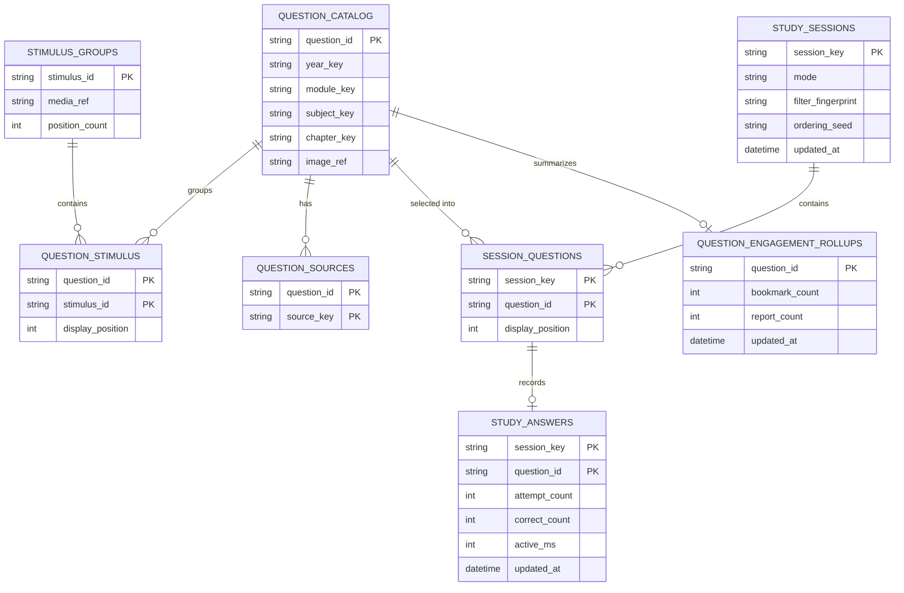

# Sanitized logical schema overview

This is an educational ER diagram, not the production database. It shows how stable content, session state, and aggregate views can be separated so that a large question bank does not require large joins or a full user-history read on every screen.

## Domain split

### 1. Stable content

`question_catalog` stores the small metadata needed to filter and identify a question. `stimulus_groups` stores shared case/media metadata. The bridge tables keep many-to-many or ordered relationships without copying the same stimulus reference into every question record.

### 2. Study state

`study_sessions` identifies a saved study context. `session_questions` stores the stable ordered set for that context. `study_answers` uses the compound key `(session_key, question_id)`, so answers from two sessions containing the same question cannot overwrite each other.

### 3. Aggregate read models

`question_engagement_rollups` is a compact question-level projection for bookmark/report counts. A public ranking projection can be kept separately and paged by period. These read models avoid joining a full private history into a leaderboard or question page.

## Illustrative partitioning guidance

- **Content domain:** keep curriculum metadata and bridge rows versioned by curriculum scope. Index the filter columns and stable ids; do not duplicate large image blobs in the question row.
- **Study-state domain:** group reads by the opaque `session_key` and use compound keys beginning with that value. This keeps one session window bounded and prevents a question id shared by two sessions from colliding.
- **Aggregate domain:** partition or roll up by period and scope so leaderboard and engagement pages read a small projection instead of the full event history.
- **Media boundary:** store a validated media reference and dimensions with metadata; keep the binary asset and its delivery cache under a separate lifecycle.

These are scale and organization guidelines, not instructions to copy a production layout. The actual server must add authorization, retention, backup, and transaction policies.

## Relationship rules

- Join content to stimulus through `question_stimulus`, not by duplicating a large case image in every row.
- Join a session to questions through `session_questions`, preserving the session-specific position.
- Join answers using both `session_key` and `question_id`; either column alone is insufficient.
- Read aggregate counters from rollups for public pages; do not join private account history into them.
- Index the columns used by curriculum filters, compound session keys, question ids, and time/period pagination.

The accompanying JavaScript files describe this model without connecting to a database: [`data-model.js`](data-model.js), [`relationship-graph.js`](relationship-graph.js), and [`query-plans.js`](query-plans.js).
